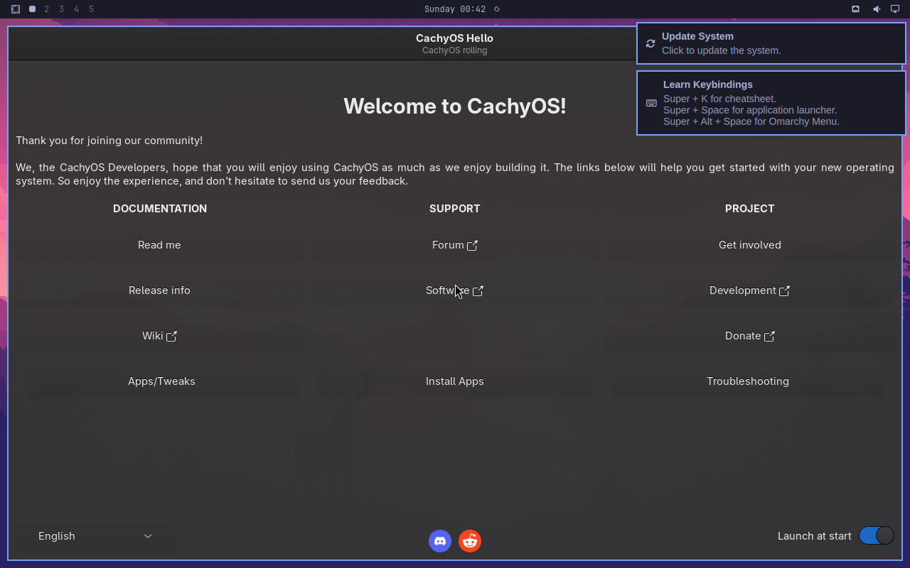

# Shokupan owns the install path; the bridge is retired

ADR-0001 installed this machine with [mroboff/omarchy-on-cachyos][bridge], a
third-party script that patches Omarchy's installer to leave CachyOS's decisions
alone. It worked, and it left nine uncommitted edits inside
`~/.local/share/omarchy` that `loaf doctor` has been watching ever since.

Under quattro the bridge stops being usable, and the reason is not that it broke —
it is that most of what it patched no longer exists. Rather than wait for it to
catch up 5,913 commits, Shokupan takes the install path over. The bridge remains
the credit for working the problem out first; ADR-0034 already states the contract
it was enforcing.

[bridge]: https://github.com/mroboff/omarchy-on-cachyos

## What the bridge does, and what survives

Measured against a `git worktree` of `origin/quattro` at `~/quattro-lab/omarchy`.
The bridge is ten concerns expressed as `sed` patches over Omarchy's installer:

| # | Bridge concern | Under quattro |
|---|---|---|
| 1 | Add `[omarchy]` to `pacman.conf`, trust key `F0134EE680CAC571` | **Still needed.** Not a patch — a setup step |
| 2 | Strip `tldr` from the base package list (CachyOS ships `tealdeer`) | **Still needed.** `install/omarchy-base.packages:121` |
| 3 | Drop `pacman.sh` from `preflight/all.sh` and `post-install/all.sh` | **Half moot, half critical.** `install/preflight/` is gone; `install/post-install/all.sh` still runs it, and it is the one that matters |
| 4 | Replace `nvidia.sh` with CachyOS 580xx driver logic | **Path moved** to `install/hardware/nvidia.sh`. Not exercised on this AMD machine |
| 5 | Drop `plymouth.sh` from `login/all.sh` | **Moot** |
| 6 | Drop `limine-snapper.sh` from `login/all.sh` | **Moot** |
| 7 | Drop `alt-bootloaders.sh` from `login/all.sh` | **Moot** |
| 8 | Remove `/etc/sddm.conf` | **Needs re-deciding.** Quattro's `login/sddm.sh` only strips keyring lines from `/etc/pam.d/sddm` |
| 9 | Disable `wpa_supplicant`, set `wifi.backend=iwd` | **Inverted.** See below |
| 10 | Pin `walker` with `IgnorePkg` | **Moot.** Quattro has no Walker at all |

`login/all.sh` on quattro is one line — `run_logged "$OMARCHY_INSTALL/login/sddm.sh"` —
which is why three of the ten evaporate together.

## The one that still matters

`install/post-install/pacman.sh` opens with:

    cp -f "$OMARCHY_PATH/default/pacman/pacman-${OMARCHY_MIRROR:-stable}.conf" /etc/pacman.conf
    cp -f "$OMARCHY_PATH/default/pacman/mirrorlist-${OMARCHY_MIRROR:-stable}" /etc/pacman.d/mirrorlist

That is the same overwrite ADR-0034 identified in `omarchy-channel-set`, except it
is unconditional and sits in the install path rather than behind a command nobody
runs. Its own comment explains why it exists — offline ISO installs use the live
medium's `pacman.conf` until this final restore — which is exactly the assumption
that does not hold when the base was installed by somebody else. It replaces the
repo list with Omarchy's vanilla-Arch one; `[cachyos*]` does not survive it.

So bridge patch #3 is not an optimisation. **It is the install path.** Everything
else on the list is tidying by comparison.

## Two concerns the bridge never had

**`install/config/snapper.sh` overwrites the root snapper config.** It runs
`install -m 0644 "$template" /etc/snapper/configs/root` and rewrites
`/etc/conf.d/snapper` to `SNAPPER_CONFIGS="root"`, then disables
`snapper-timeline.timer`. On a CachyOS install snapper is already configured and
`limine-snapper-sync` already enabled, so this silently replaces the base's
retention policy with Omarchy's. New patch needed.

**Quattro reversed the WiFi backend.** `install/hardware/network.sh` now runs
`systemctl disable iwd.service`, `iwd` is gone from `omarchy-base.packages`, and
NetworkManager is left on its default `wpa_supplicant` backend. The bridge's
patch #9 did the opposite. This machine still carries `wifi.backend=iwd` in
`/etc/NetworkManager/NetworkManager.conf`, and `loaf doctor`'s `wifi backend`
check (ADR-0034) currently warns when it is *missing* — under quattro that check
has to invert or be dropped. It is the first of ADR-0034's four base checks to
expire, and a reminder that they assert bridge side effects, not CachyOS truths.

## The shape of the replacement

Not "a better `sed` script". The bridge's fragility is that it edits Omarchy's
installer in place, so every upstream refactor breaks it silently — five of its
nine live patches now target files that do not exist, and nothing said so.

What the install path should be instead:

1. **Install CachyOS normally.** Base, kernel, bootloader, snapper — untouched by
   anything downstream.
2. **Add the `[omarchy]` repo** above nothing; it coexists with `[cachyos*]`.
3. **Run Omarchy's installer with the destructive steps disabled**, preferring
   environment variables and skip-lists over `sed` where quattro offers them —
   `install/config/snapper.sh` already reads `OMARCHY_SNAPPER_CONFIG_PATH`, which
   suggests upstream is willing to be overridden.
4. **Assert the base afterwards with `loaf doctor`**, which is where the real
   guard lives: detective, not preventive (ADR-0034).

Step 3 is the open question, and it cannot be answered by reading — it needs an
install to fail against. That is what the fresh-quattro-elsewhere build is for.
This ADR stays `proposed` until one has actually been run.

## The lab

`lab/quattro-vm` builds it: a CachyOS VM this repo did not install, so the
layering steps fail honestly rather than succeeding by accident on a machine that
already has everything. `lab/` is repo-only and Stow-ignored.

Two settings there are load-bearing rather than incidental. **`--cpu
host-passthrough`**, because CachyOS's znver4 repos are gated on the CPU
reporting Zen 4 feature flags — under an emulated model the guest quietly falls
back to the generic repos and stops being the base under test. And **UEFI**,
because the real machine boots Limine on UEFI and the installer takes a different
path on BIOS.

The guest also needs the host firewall opened, which is not obvious from the
symptom: Omarchy enables ufw with a default-`DROP` `FORWARD` policy, libvirt's
own rules live in a separate nft table that ufw's chains pre-empt, and the result
is a guest that boots to a working desktop with no IP. That reads as a broken VM.
`quattro-vm create` now refuses to run until three virbr0-scoped rules exist, and
prints them. It grants the bridge and nothing wider.

## What the first real install established, 2026-08-08

The base is built and snapshotted as `base-cachyos`. It is CachyOS by every
measure that matters here: `[cachyos-znver4]`, `[cachyos-core-znver4]` and
`[cachyos-extra-znver4]` sit above `core`/`extra` in `/etc/pacman.conf`,
`linux-cachyos 7.1.6-1` is the running kernel, and Limine 12.5.2 ships with
`limine-snapper-sync` and `snapper`. Root is `/dev/vda2[/@]` btrfs with
`@ @home @root @srv @cache @tmp @log`, and the ESP is `/dev/vda1` vfat at
**`/boot`** — not `/boot/efi` — which is what the real machine has, down to
`/boot` being unreadable to a non-root user.

The znver4 repos are the proof that `--cpu host-passthrough` is load-bearing
rather than decorative. They would not be selected on an emulated CPU model.

Four findings that the install path has to carry:

**Calamares dies on the locale when driven headlessly.** Its `pacstrap` module
decodes pacman's output with the ASCII codec, so the first non-ASCII byte pacman
emits raises `UnicodeDecodeError` and Calamares reports
`Boost.Python error in job "pacstrap"` — naming neither the locale nor the real
error. A desktop-launched Calamares inherits the session's UTF-8 locale and never
sees it; one launched over SSH inherits `LANG=` and `LC_CTYPE=POSIX` and always
does. The fix is `LANG=C.UTF-8 LC_ALL=C.UTF-8 PYTHONIOENCODING=utf-8`.

**The live ISO's text installer cannot express this layout.** Its UEFI-mountpoint
radio group accepts neither keyboard nor synthetic mouse input, so `/boot` is
unreachable and it forces `/boot/efi`. It is also the component that silently
produced a plan with root and boot on the same partition as ext4. Calamares set
`/boot` and btrfs without argument. Do not retry the TUI.

**A failed install wedges the disk until a reboot.** The live kernel keeps the
btrfs signature on the root partition registered even with nothing mounted;
`wipefs`, `btrfs device scan --forget` and killing Calamares all return
`Device or resource busy`. `sgdisk --zap-all` still writes — it just cannot
inform the running kernel — so the disk comes back clean afterwards.

**CachyOS enables ufw in the installed system.** Fresh out of the installer,
`ufw` is active and `firewalld` inactive, so nothing reaches the guest until a
rule is added. Worth knowing before ADR-0016's remote access is layered on.

`lab/quattro-vm calamares` and `lab/quattro-vm recover` print the first three, so
they are recoverable from the tool rather than only from this document.

## Quattro layers onto CachyOS. It takes four patches, 2026-08-09

Run end to end in the lab. The result is snapshotted as `quattro-layered`: Hyprland
and quickshell running, quattro's bar and menus live, on `linux-cachyos 7.1.6-1`
with every `[cachyos*]` repo intact. **The base survives.** That answers the
question ADR-0034 left open.

The vehicle is `omarchy-upgrade-to-quattro`, not the installer — and it is far less
hostile to the base than `install/post-install/pacman.sh`. Its `pacman.conf` edit is
a surgical awk that replaces only the `[omarchy]` section and passes every other
line through, so `[cachyos-znver4]` and friends are untouched.

**The one root cause is the mirror, and everything else follows from it.**
`configure_pacman_channel` overwrites `/etc/pacman.d/mirrorlist` with a single
`Server = https://stable-mirror.omarchy.org/$repo/os/$arch`. That mirror is a
*frozen* Arch snapshot: it served `gstreamer 1.28.5-2` while CachyOS had already
installed `1.28.6-1`. Since CachyOS tracks Arch rolling, pinning core/extra to
Omarchy's snapshot puts the two halves of the system into permanent version skew,
and pacman refuses the resulting partial downgrades.

That skew is what produced the aquamarine mess, which looked like an independent ABI
problem and was not. Under the frozen mirror, `extra/hyprland 0.56.0-2` wanted
`libaquamarine.so=12-64` while CachyOS's `aquamarine 0.14.0` provides `so=13`;
pinning the Arch stack then broke `hyprtoolkit`, which wants `so=13`. Restoring the
rolling mirrorlist collapses all of it — CachyOS's `aquamarine 0.14.0`,
`hyprland 0.56.2-1` and `hyprtoolkit 0.5.4-4.1` are mutually consistent. **Do not
pin the hypr stack.** Fix the mirror and the ABI conflict disappears.

The four patches:

| # | Patch | Why |
|---|---|---|
| 1 | Comment out the `mirrorlist` overwrite in `configure_pacman_channel` | Omarchy pins a frozen Arch snapshot; CachyOS is rolling. The root cause |
| 2 | Reconcile once with `pacman -Syu` before re-running | The failed attempts leave a half-frozen, half-rolling system |
| 3 | Remove the fish stack (`cachyos-fish-config fish fish-autopair fish-pure-prompt fisher`) | `cachyos-fish-config` requires `tealdeer`, which hard-conflicts with Omarchy's `tldr`. `chsh -s /bin/bash` **first** — it is the login shell |
| 4 | Nothing for `tldr` | Patch 3 removes the conflict at its source, so bridge patch #2 is finally unnecessary |

Patch 3 is the bridge's `tldr` concern resurfacing as a hard dependency conflict
rather than a preference. Removing fish is the better fix than patching Omarchy's
package list, because that list ships inside the `omarchy` package now and any
edit to it is reverted by the next package upgrade.

**Quattro guards pacman.** It installs a hook that refuses a direct `pacman -Syu`
and demands `OMARCHY_ALLOW_DIRECT_PACMAN=1`. `~/.local/bin/system-update` calls
`pacman -Syu` directly (ADR-0034) and will break the day this machine moves; it
needs that variable or Omarchy's own updater.

**Loose ends, recorded rather than resolved:**

- The upgrade installed `omarchy-dev` / `omarchy-settings-dev 4.0.0` even on the
  `stable` channel with no `--dev`. Not investigated.
- `quickshell 0.3.0-2.1` from CachyOS is what ended up installed, and the shell runs.
  ADR-0033 says quattro needs `quickshell-git` because `0.3.0`'s `kill` returns
  immediately; the installed `omarchy-restart-shell` uses `pkill -x quickshell`, so
  that claim may be stale. Worth rechecking before treating it as a constraint.
- The lab has no display manager by default (No Desktop install), so `sddm` had to be
  started by hand. On a base installed with Plasma this would not appear.

## Consequences

- ADR-0001 stays `accepted` as the record of how *this* machine was built. It is
  history, not instructions.
- The bridge's nine dirty patches in `~/.local/share/omarchy` are not carried
  forward. They are captured as a diff in `~/snapshots/pre-omarchy-update-*`.
- `loaf doctor`'s base checks are versioned against Omarchy like everything else.
  The `wifi backend` check is already known-stale for quattro.
- Anyone installing from this repo gets Shokupan's path, not the bridge's — which
  means the repo now owes them one that works.
